# 1605 计量打压系统 — 完整业务逻辑技术文档

> **版本**: 2.0 | **最后更新**: 2026-04-20 | **目标读者**: 产品人员、业务分析师、新加入项目的开发人员

---

## 目录

1. [系统概述](#1-系统概述)
2. [核心业务实体](#2-核心业务实体)
3. [业务实体关系图](#3-业务实体关系图)
4. [主要业务流程](#4-主要业务流程)
5. [业务规则和约束条件](#5-业务规则和约束条件)
6. [关键业务场景及交互逻辑](#6-关键业务场景及交互逻辑)
7. [业务数据流转路径](#7-业务数据流转路径)
8. [异常处理流程](#8-异常处理流程)
9. [配置管理业务逻辑](#9-配置管理业务逻辑)
10. [报告导出业务逻辑](#10-报告导出业务逻辑)
11. [报警管理业务逻辑](#11-报警管理业务逻辑)
12. [设备管理业务逻辑](#12-设备管理业务逻辑)
13. [采集模式详解](#13-采集模式详解)
14. [业务术语表](#14-业务术语表)

---

## 1. 系统概述

### 1.1 系统定位

1605 计量打压系统是一套用于**压力设备校准**的桌面应用程序。核心业务目标是：控制打压设备产生精确的目标压力，通过计量设备采集各通道的测量数据，验证采集数据是否符合精度要求，最终生成校准报告。

### 1.2 核心业务场景

```
业务操作流程：

  1. 设备准备 → 2. 参数配置 → 3. 执行采集 → 4. 报警处理 → 5. 导出报告

┌──────────┐   ┌──────────┐   ┌──────────┐   ┌──────────┐   ┌──────────┐
│ 连接设备 │ → │ 设定参数 │ → │ 自动打压 │ → │ 精度校验 │ → │ 生成报告 │
│ 打压设备 │   │ 压力范围 │   │ 逐点采集 │   │ 报警提示 │   │ Excel格式│
│ 计量设备 │   │ 精度要求 │   │ 稳定检测 │   │ 用户确认 │   │ 校准数据 │
└──────────┘   └──────────┘   └──────────┘   └──────────┘   └──────────┘
```

### 1.3 业务价值

- **提高校准效率**：自动化打压采集流程，减少人工操作
- **保证数据准确性**：多通道并行采集，自动精度校验
- **标准化报告**：基于模板生成标准化校准报告
- **可追溯性**：完整的采集会话记录，支持数据追溯

---

## 2. 核心业务实体

### 2.1 打压设备（Pressure Device）

**业务定义**：用于产生和控制压力的物理设备，是校准过程的压力源。

**业务属性**：
- 设备型号：ConST 811A、ConST 820、ConST 860、SPC4000 等
- 连接方式：TCP 网络连接（IP 地址 + 端口）
- 压力单位：MPa、kPa、bar、psi、kgf/cm² 等
- 工作状态：未连接、连接中、已连接、工作中、错误

**业务能力**：
- 设置目标压力值
- 读取当前压力值
- 执行排空操作（释放压力）
- 设置和读取压力单位
- 监控压力稳定性

### 2.2 计量设备（Measure Device）

**业务定义**：用于采集压力数据的物理设备，每个设备具备 16 个独立数据采集通道。

**业务属性**：
- 设备型号：WTN1604（自研 16 通道计量模块）
- 连接方式：TCP 网络连接（IP 地址 + 端口）
- 通道数量：16 个独立通道（通道号 0-15）
- 阀门状态：校准状态、采集状态
- 压力单位：与打压设备保持一致

**业务能力**：
- 采集 16 通道压力数据
- 读取和设置阀门状态
- 读取和设置压力单位
- 多次采样求平均值
- 模块信息查询（型号、固件版本）

### 2.3 校准配置（Calibration Config）

**业务定义**：定义校准过程的参数和规则。

**业务属性**：

| 参数名称 | 业务含义 | 取值范围 |
|---------|---------|---------|
| 校准最小值 | 目标压力范围下限 | 数值 |
| 校准最大值 | 目标压力范围上限 | 数值 |
| 校准点数 | 目标压力点的数量 | 2-11 点 |
| 精度 | 采集数据的小数点后有效位数 | 0-6 位 |
| 采集平均数 | 每个数据点采集次数，取平均值 | 1-10 次 |
| 精度 Level | 目标压力值与实际采集压力值之间的允许偏差范围 | 百分比（%） |
| 稳定持续时间 | 压力稳定后需保持稳定的持续时间 | 秒（1s、3s、5s、10s 或自定义） |
| 打压模式 | 单程/回程模式选择 | 单程(s)、回程(m) |
| 控制模式 | 手动/自动模式选择 | 手动、自动 |

### 2.4 目标压力点（Pressure Point）

**业务定义**：校准过程中需要达到的目标压力值列表。

**业务属性**：
- 压力值：目标压力数值
- 索引：在压力点列表中的位置
- 状态：待打压、打压中、稳定中、采集中、已完成、错误
- 采集数据：该压力点下采集的 16 通道数据

### 2.5 采集会话（Collection Session）

**业务定义**：一次完整的校准采集过程的业务记录。

**业务属性**：
- 会话 ID：唯一标识一次采集会话
- 开始时间：会话启动时间
- 结束时间：会话完成时间
- 校准配置：本次会话使用的校准参数
- 压力点列表：本次会话需要采集的所有压力点
- 打压设备 ID：本次会话使用的打压设备
- 计量设备 ID 列表：本次会话使用的计量设备
- 会话状态：空闲、进行中、已完成、错误

### 2.6 通道数据（Channel Data）

**业务定义**：计量设备单个通道采集到的压力数据。

**业务属性**：
- 通道号：0-15
- 压力值：采集到的压力数值
- 单位：压力单位
- 时间戳：采集时间

### 2.7 报警记录（Alarm Record）

**业务定义**：当采集数据精度超过允许偏差时触发的报警记录。

**业务属性**：
- 压力点 ID：触发报警的压力点
- 目标压力：该压力点的目标压力值
- 偏差阈值：允许的偏差范围
- 最大偏差：实际采集数据中的最大偏差
- 超限通道列表：超出偏差阈值的通道信息

---

## 3. 业务实体关系图

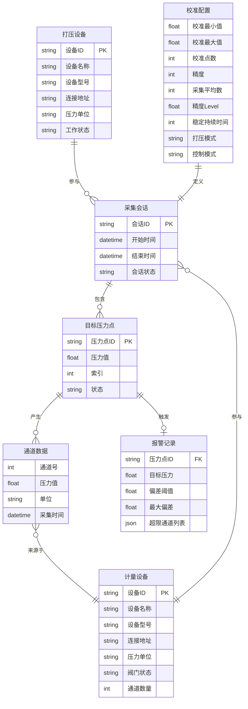

---

## 4. 主要业务流程

### 4.1 设备管理流程

#### 4.1.1 设备添加流程

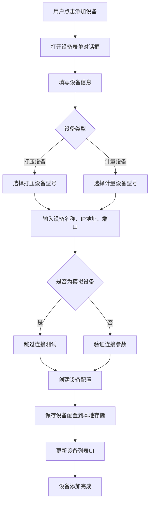

**业务规则**：
- 设备 ID 必须唯一
- 设备名称用户自定义，用于界面显示
- IP 地址和端口用于 TCP 网络连接
- 模拟设备用于开发测试，不需要真实物理设备
- 设备配置持久化存储，系统重启后自动加载

#### 4.1.2 设备连接流程

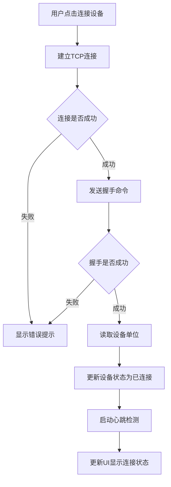

**业务规则**：
- 连接超时时间：10 秒
- 命令超时时间：5 秒
- 连接失败支持自动重连（可配置）
- 最大重连次数：5 次
- 重连间隔：1 秒

#### 4.1.3 批量连接流程

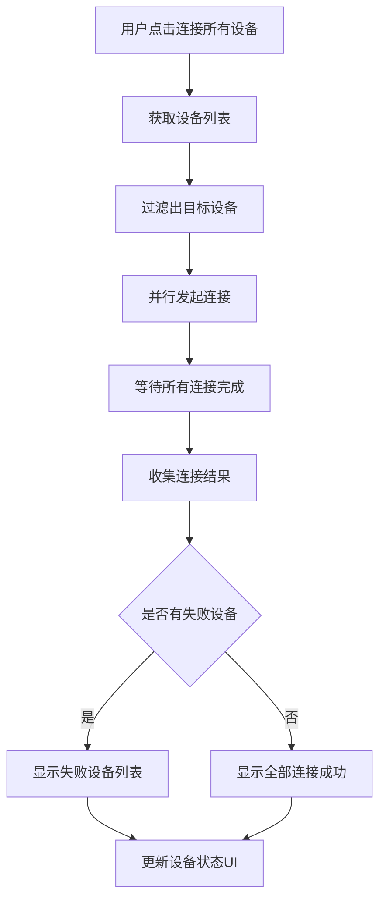

**业务规则**：
- 支持按设备类型过滤（仅连接打压设备或仅连接计量设备）
- 并行连接提高连接效率
- 返回批量连接结果：成功列表、失败列表

#### 4.1.4 设备断开流程

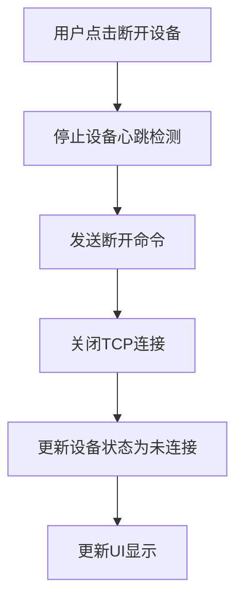

### 4.2 校准参数配置流程

#### 4.2.1 参数配置流程

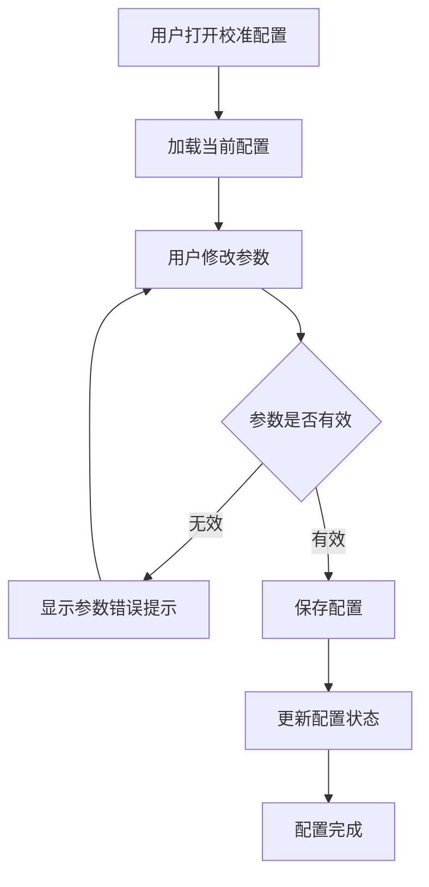

**参数验证规则**：
- 校准最大值必须大于校准最小值
- 校准点数：2-11 点
- 精度：0-6 位小数
- 采集平均数：1-10 次
- 精度 Level：百分比值，如 0.0001-0.002（0.01%-0.2%）
- 稳定持续时间：可选 1s、3s、5s、10s 或自定义

#### 4.2.2 目标压力点生成流程

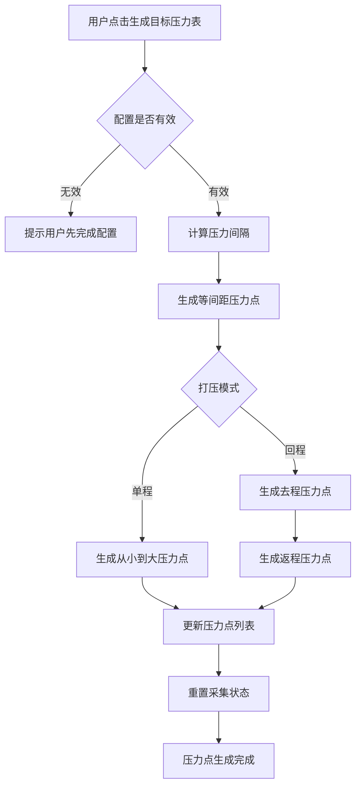

**生成规则**：

**单程模式**：
- 压力点从最小值到最大值等间距分布
- 公式：`压力值 = 最小值 + (最大值 - 最小值) / (点数 - 1) × 索引`
- 示例：最小值 0，最大值 100，5 点 → [0, 25, 50, 75, 100]

**回程模式**：
- 去程：从最小值到最大值（同单程）
- 返程：从最大值回到最小值（不包括最小值）
- 示例：最小值 0，最大值 100，5 点 → [0, 25, 50, 75, 100, 75, 50, 25]
- 总点数 = 2 × 校准点数 - 1

### 4.3 自动采集流程

#### 4.3.1 采集启动前置条件检查

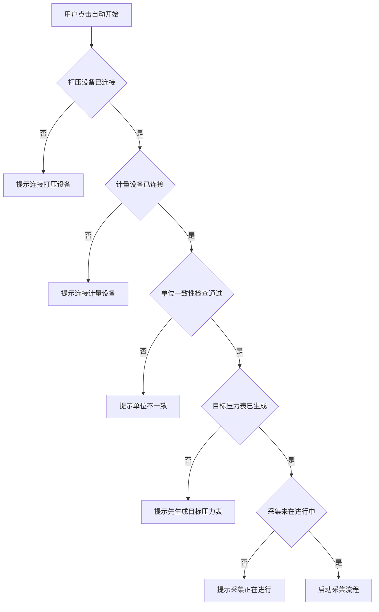

**前置条件**：
1. 至少连接一台打压设备
2. 至少连接一台计量设备
3. 所有设备单位一致（打压设备单位 = 所有计量设备单位）
4. 已生成目标压力表
5. 采集未在进行中

#### 4.3.2 自动采集主流程

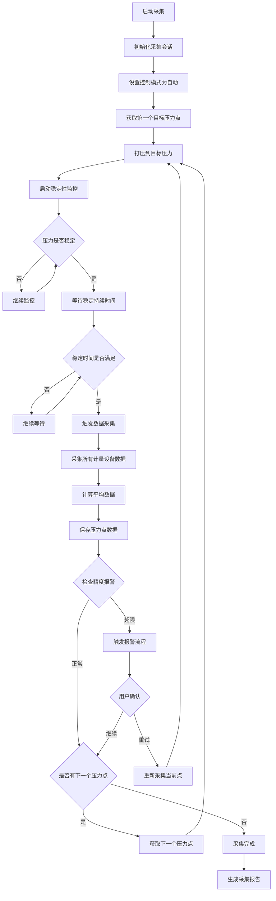

**采集状态流转**：

```
空闲(idle) → 打压中(pressuring) → 稳定中(stabilizing) → 采集中(collecting) → 已完成(completed)
                                              ↓
                                           错误(error)
                                              ↓
                                           暂停(paused)
                                              ↓
                                           恢复(resume)
```

**业务规则**：
- 每个压力点必须达到稳定状态才能采集数据
- 稳定状态定义：压力值在目标值的阈值范围内，且持续稳定时间达到设定值
- 稳定性阈值：默认 0.001
- 稳定持续时间：默认 5 秒（可配置）
- 数据采集：采集所有计量设备的所有通道数据
- 多次采样求平均：根据配置的采集平均数，多次采集取平均值

#### 4.3.3 稳定性监控流程

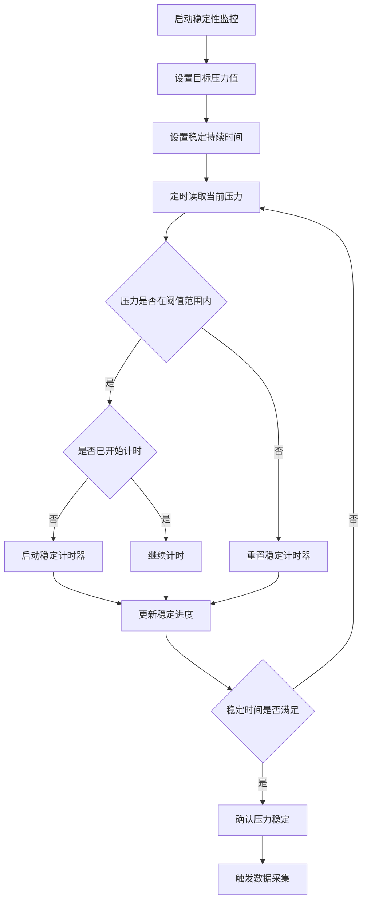

**稳定性判断规则**：
- 偏差 = |当前压力值 - 目标压力值|
- 稳定条件：偏差 ≤ 稳定性阈值
- 累积稳定时间：只有持续稳定才计时
- 稳定中断：一旦超出阈值，立即重置计时器
- 稳定进度：已稳定时间 / 要求稳定时间 × 100%

### 4.4 手动采集流程

#### 4.4.1 手动模式操作流程

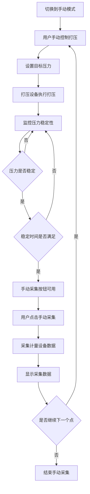

**手动模式特点**：
- 用户手动控制打压过程
- 系统监控压力稳定性
- 压力稳定后，用户手动触发数据采集
- 适合需要精细控制打压过程的场景

### 4.5 精度报警流程

#### 4.5.1 报警触发流程

```mermaid
flowchart TD
    A[采集数据完成] --> B[获取精度Level阈值]
    B --> C[计算每个通道的偏差]
    C --> D{偏差 = |采集值 - 目标值|}
    D --> E{是否有通道偏差超过阈值}
    E -->|否| F[数据正常]
    E -->|是| G[触发报警]
    G --> H[记录报警信息]
    H --> I[高亮显示超限通道]
    I --> J{是否需要用户确认}
    J -->|否| K[自动继续采集]
    J -->|是| L[弹出报警对话框]
    L --> M[等待用户决策]
    M --> N{用户选择}
    N -->|继续| O[继续下一个压力点]
    N -->|重试| P[重新采集当前压力点]
```

**报警规则**：
- 偏差计算：|实际采集压力值 - 目标压力值|
- 报警阈值：精度 Level（百分比值）
- 超限通道：偏差超过阈值的通道
- 报警显示：超限通道数据背景色或数值颜色变化
- 用户确认：可配置是否需要用户确认（confirmOnAlarm）
- 报警通道：可配置启用报警检测的通道列表（默认全部 16 通道）

#### 4.5.2 报警处理流程

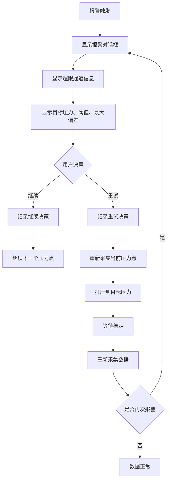

---

## 5. 业务规则和约束条件

### 5.1 设备管理规则

| 规则编号 | 规则描述 | 约束条件 |
|---------|---------|---------|
| DM-001 | 设备 ID 必须唯一 | 系统内不允许重复的设备 ID |
| DM-002 | 设备名称用户自定义 | 用于界面显示，建议具有描述性 |
| DM-003 | 打压设备和计量设备单位必须一致 | 执行采集操作前自动验证 |
| DM-004 | 设备配置持久化存储 | 系统重启后自动加载已配置设备 |
| DM-005 | 设备连接超时 | 连接超时时间 10 秒 |
| DM-006 | 设备命令超时 | 命令超时时间 5 秒 |
| DM-007 | 设备支持自动重连 | 可配置，默认关闭 |
| DM-008 | 设备断路器保护 | 连续失败 5 次后打开断路器，30 秒后恢复 |

### 5.2 校准配置规则

| 规则编号 | 规则描述 | 约束条件 |
|---------|---------|---------|
| CC-001 | 校准最大值必须大于最小值 | maxPressure > minPressure |
| CC-002 | 校准点数范围 | 2 ≤ pointCount ≤ 11 |
| CC-003 | 精度范围 | 0 ≤ precision ≤ 6 |
| CC-004 | 采集平均数范围 | 1 ≤ averageCount ≤ 10 |
| CC-005 | 精度 Level 范围 | 0.0001 ≤ precisionLevel ≤ 0.002（0.01%-0.2%） |
| CC-006 | 稳定持续时间 | 可选 1s、3s、5s、10s 或自定义 |
| CC-007 | 打压模式 | 单程(s) 或 回程(m) |
| CC-008 | 控制模式 | 自动(auto) 或 手动(manual) |

### 5.3 采集流程规则

| 规则编号 | 规则描述 | 约束条件 |
|---------|---------|---------|
| CP-001 | 采集前置条件 | 打压设备已连接、计量设备已连接、单位一致、目标压力表已生成 |
| CP-002 | 压力稳定条件 | 偏差 ≤ 稳定性阈值，且持续稳定时间达到设定值 |
| CP-003 | 稳定性阈值 | 默认 0.001 |
| CP-004 | 稳定持续时间 | 默认 5 秒（可配置） |
| CP-005 | 数据采集时机 | 只有压力稳定后才能采集数据 |
| CP-006 | 多次采样求平均 | 根据配置的采集平均数，多次采集取平均值 |
| CP-007 | 采集数据完整性 | 必须采集所有计量设备的所有通道数据 |
| CP-008 | 采集状态不可逆 | 已完成的状态不能回退到待打压状态 |

### 5.4 精度报警规则

| 规则编号 | 规则描述 | 约束条件 |
|---------|---------|---------|
| AL-001 | 报警触发条件 | 通道偏差超过精度 Level 阈值 |
| AL-002 | 偏差计算 | 偏差 = |实际采集压力值 - 目标压力值| |
| AL-003 | 报警阈值 | 精度 Level（百分比值） |
| AL-004 | 报警显示 | 超限通道数据背景色或数值颜色变化 |
| AL-005 | 用户确认 | 可配置是否需要用户确认 |
| AL-006 | 报警通道 | 可配置启用报警检测的通道列表 |
| AL-007 | 报警处理 | 用户可选择继续或重试 |

### 5.5 报告导出规则

| 规则编号 | 规则描述 | 约束条件 |
|---------|---------|---------|
| RP-001 | 报告导出前置条件 | 采集会话已完成 |
| RP-002 | 报告模板匹配 | 根据点数和打压模式匹配模板文件 |
| RP-003 | 报告内容 | 包含所有 16 通道采集数据、各目标压力点打压情况、精度校验结果 |
| RP-004 | 报告格式 | Excel 格式（.xlsx） |
| RP-005 | 报告单位 | 优先取打压设备实际单位 |
| RP-006 | 模板优先级 | 用户模板 > 内置模板 > 动态生成 |

---

## 6. 关键业务场景及交互逻辑

### 6.1 场景一：标准校准流程

**业务描述**：用户按照标准流程完成一次完整的校准工作。

**交互流程**：

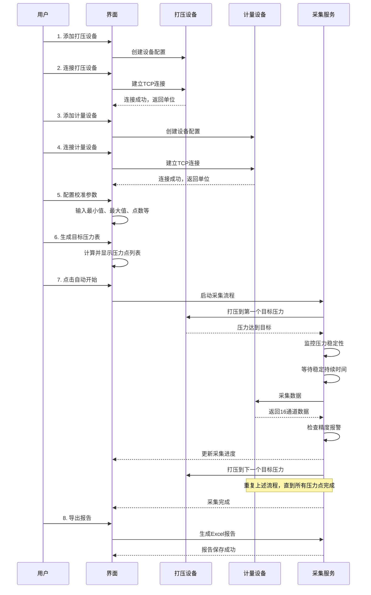

### 6.2 场景二：单位不一致处理

**业务描述**：打压设备和计量设备单位不一致时，系统阻止采集操作。

**交互流程**：

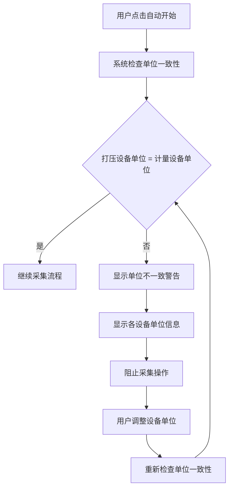

**界面交互**：
- 单位一致性指示器实时显示单位匹配状态
- 单位不一致时，显示红色警告图标
- 点击警告图标，显示详细单位信息
- 提供单位设置入口，方便用户快速调整

### 6.3 场景三：精度报警处理

**业务描述**：采集过程中，某个通道数据精度超限，触发报警。

**交互流程**：

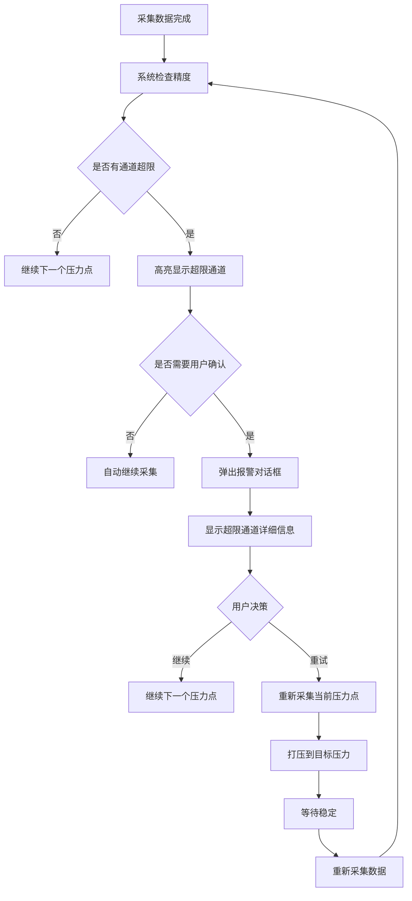

**界面交互**：
- 超限通道数据背景色变为红色
- 报警对话框显示：目标压力、阈值、最大偏差、超限通道列表
- 提供"继续"和"重试"两个操作按钮
- 继续：忽略报警，继续下一个压力点
- 重试：重新采集当前压力点

### 6.4 场景四：采集暂停和恢复

**业务描述**：用户在采集过程中暂停采集，稍后恢复。

**交互流程**：

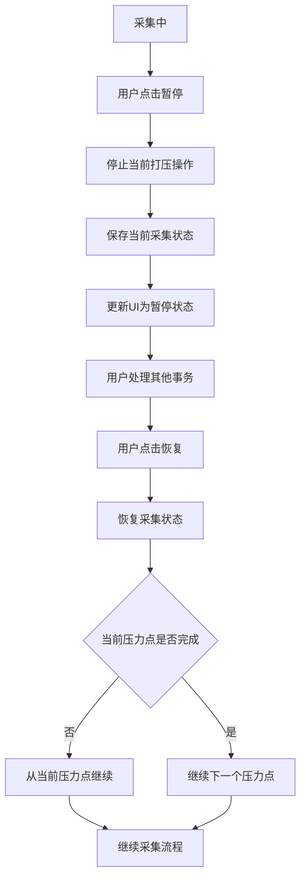

**业务规则**：
- 暂停时保存当前采集状态
- 恢复时从暂停点继续
- 当前压力点未完成，重新执行该压力点
- 当前压力点已完成，继续下一个压力点

### 6.5 场景五：设备连接失败处理

**业务描述**：设备连接失败时，系统的处理流程。

**交互流程**：

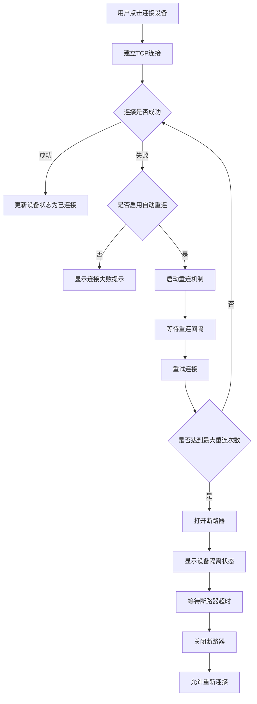

**业务规则**：
- 连接失败显示错误提示
- 自动重连：可配置，默认关闭
- 最大重连次数：5 次
- 重连间隔：1 秒
- 断路器保护：连续失败 5 次后打开断路器，30 秒后恢复
- 断路器打开期间，设备状态显示为"已隔离"

---

## 7. 业务数据流转路径

### 7.1 设备配置数据流

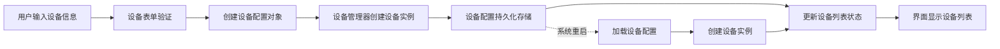

### 7.2 采集数据流

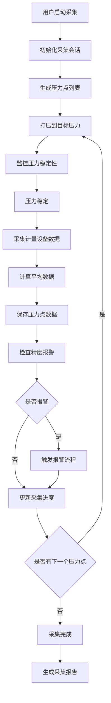

### 7.3 报告数据流

```mermaid
flowchart LR
    A[采集会话数据] --> B[加载Excel模板]
    B --> C[填充报告头部信息]
    C --> D[填充压力点数据]
    D --> E[填充通道数据]
    E --> F[填充精度校验结果]
    F --> G[生成Excel文件]
    G --> H[用户选择保存路径]
    H --> I[保存报告文件]
```

### 7.4 配置数据流

```mermaid
flowchart LR
    A[用户修改配置] --> B[配置验证]
    B --> C[更新内存配置]
    C --> D[持久化存储]
    D --> E[更新界面显示]
    
    E -.系统重启.-> F[加载配置]
    F --> G[恢复配置状态]
    G --> E
```

---

## 8. 异常处理流程

### 8.1 设备通信异常

```mermaid
flowchart TD
    A[设备通信失败] --> B{失败类型}
    B -->|连接超时| C[重试连接]
    B -->|命令超时| D[重试命令]
    B -->|设备无响应| E[检查设备状态]
    C --> F{是否达到最大重试次数}
    D --> F
    E --> F
    F -->|否| G[继续重试]
    F -->|是| H[标记设备为错误状态]
    H --> I[显示错误提示]
    I --> J[记录错误日志]
```

**处理策略**：
- 连接超时：重试连接，最多 5 次
- 命令超时：重试命令，最多 3 次
- 设备无响应：检查设备状态，尝试重新连接
- 达到最大重试次数：标记设备为错误状态
- 记录错误日志，便于后续排查

### 8.2 采集流程异常

```mermaid
flowchart TD
    A[采集流程异常] --> B{异常类型}
    B -->|打压失败| C[停止采集]
    B -->|数据采集失败| D[记录错误数据]
    B -->|设备断开| E[暂停采集]
    C --> F[显示错误提示]
    D --> F
    E --> F
    F --> G[保存当前采集状态]
    G --> H{用户决策}
    H -->|重试| I[重新执行当前压力点]
    H -->|跳过| J[继续下一个压力点]
    H -->|停止| K[结束采集]
```

**处理策略**：
- 打压失败：停止采集，显示错误提示
- 数据采集失败：记录错误数据，标记该压力点为错误
- 设备断开：暂停采集，等待设备重新连接
- 用户可选择重试、跳过或停止采集

### 8.3 精度报警异常

```mermaid
flowchart TD
    A[精度报警] --> B[记录报警信息]
    B --> C[高亮显示超限通道]
    C --> D{是否需要用户确认}
    D -->|否| E[自动继续采集]
    D -->|是| F[弹出报警对话框]
    F --> G[等待用户决策]
    G --> H{用户选择}
    H -->|继续| I[继续下一个压力点]
    H -->|重试| J[重新采集当前压力点]
    J --> K{是否再次报警}
    K -->|是| B
    K -->|否| L[数据正常]
```

**处理策略**：
- 自动模式：可配置是否自动继续
- 手动模式：必须用户确认
- 用户可选择继续或重试
- 重试后再次报警，继续提示用户

### 8.4 报告导出异常

```mermaid
flowchart TD
    A[报告导出失败] --> B{失败原因}
    B -->|模板不存在| C[使用动态生成模板]
    B -->|文件保存失败| D[提示用户重新选择路径]
    B -->|数据不完整| E[提示数据不完整]
    C --> F[继续导出]
    D --> G[用户选择新路径]
    G --> F
    E --> H[终止导出]
    F --> I{导出是否成功}
    I -->|是| J[显示成功提示]
    I -->|否| B
```

**处理策略**：
- 模板不存在：使用动态生成模板
- 文件保存失败：提示用户重新选择路径
- 数据不完整：提示数据不完整，终止导出
- 导出失败：显示错误提示，允许重试

---

## 9. 配置管理业务逻辑

### 9.1 配置加载流程

```mermaid
flowchart TD
    A[应用启动] --> B[检查配置文件是否存在]
    B -->|存在| C[读取配置文件]
    B -->|不存在| D[创建默认配置]
    C --> E[解析配置数据]
    E --> F{配置是否有效}
    F -->|无效| D
    F -->|有效| G[合并默认配置]
    G --> H[加载配置到内存]
    H --> I[初始化配置状态]
    D --> H
```

**配置迁移规则**：
- 精度 Level 比例尺版本升级时，自动迁移旧配置
- 迁移规则：旧值 / 10 = 新值
- 迁移后更新配置版本标识

### 9.2 配置保存流程

```mermaid
flowchart TD
    A[用户修改配置] --> B[更新内存配置]
    B --> C[触发配置保存]
    C --> D[验证配置数据]
    D --> E{配置是否有效}
    E -->|无效| F[显示错误提示]
    E -->|有效| G[序列化配置数据]
    G --> H[写入配置文件]
    H --> I[更新配置状态]
```

**保存策略**：
- 配置修改后立即保存到内存
- 异步持久化到文件系统
- 配置文件格式：JSON
- 配置文件路径：用户数据目录/config.json

### 9.3 设备选择记忆

```mermaid
flowchart TD
    A[用户选择设备] --> B[记录设备ID]
    B --> C[保存到配置]
    C --> D[下次启动时恢复]
    D --> E[自动选择上次使用的设备]
```

**业务规则**：
- 记录上次使用的打压设备 ID
- 记录上次使用的计量设备 ID 列表
- 应用重启后自动恢复设备选择

---

## 10. 报告导出业务逻辑

### 10.1 模板匹配流程

```mermaid
flowchart TD
    A[开始导出报告] --> B[获取采集会话数据]
    B --> C[计算基础点数]
    C --> D{打压模式}
    D -->|单程| E[点数 = 压力点数量]
    D -->|回程| F[点数 = (压力点数量 + 1) / 2]
    E --> G[生成模板文件名]
    F --> G
    G --> H[查找用户模板]
    H --> I{模板是否存在}
    I -->|是| J[使用用户模板]
    I -->|否| K[查找内置模板]
    K --> L{模板是否存在}
    L -->|是| M[使用内置模板]
    L -->|否| N[动态生成模板]
    J --> O[加载模板文件]
    M --> O
    N --> O
```

**模板命名规则**：
- 格式：`{点数}{模式}.xlsx`
- 模式：s = 单程，m = 回程
- 示例：`5s.xlsx`（5 点单程模板）、`5m.xlsx`（5 点回程模板）

**模板优先级**：
1. 用户模板目录（优先）
2. 内置模板目录
3. 动态生成模板（兜底）

### 10.2 报告填充流程

```mermaid
flowchart TD
    A[加载模板] --> B[填充报告头部]
    B --> C[填充设备信息]
    C --> D[填充校准参数]
    D --> E[填充压力点数据]
    E --> F[填充通道数据]
    F --> G[填充精度校验结果]
    G --> H[生成Excel文件]
    H --> I[保存文件]
```

**报告内容**：
- 报告头部：报告标题、日期、单位
- 设备信息：打压设备型号、计量设备型号
- 校准参数：最小值、最大值、点数、精度等
- 压力点数据：每个压力点的目标压力、实际压力、偏差
- 通道数据：16 通道的采集数据
- 精度校验结果：是否合格、超限通道

### 10.3 导出进度反馈

```mermaid
flowchart TD
    A[开始导出] --> B[准备阶段 0%]
    B --> C[读取模板 10%]
    C --> D[填充数据 40%]
    D --> E[保存文件 80%]
    E --> F[导出完成 100%]
    F --> G[显示成功提示]
```

**进度阶段**：
- preparing（准备中）：0%
- reading_template（读取模板）：10%
- filling_data（填充数据）：40%
- saving（保存文件）：80%
- completed（完成）：100%

---

## 11. 报警管理业务逻辑

### 11.1 报警配置

```mermaid
flowchart TD
    A[用户打开报警配置] --> B[加载当前报警配置]
    B --> C[显示配置界面]
    C --> D[用户修改配置]
    D --> E{配置是否有效}
    E -->|无效| F[显示错误提示]
    E -->|有效| G[保存配置]
    G --> H[更新报警状态]
```

**报警配置项**：
- 启用报警：是否启用报警检测
- 精度阈值：报警触发阈值
- 声音提示：是否启用声音报警
- 用户确认：是否需要用户确认
- 启用通道：启用报警检测的通道列表（0-15）

### 11.2 报警检测流程

```mermaid
flowchart TD
    A[采集数据完成] --> B[获取报警配置]
    B --> C{报警是否启用}
    C -->|否| D[跳过报警检测]
    C -->|是| E[获取启用通道列表]
    E --> F[遍历启用通道]
    F --> G[计算通道偏差]
    G --> H{偏差是否超过阈值}
    H -->|否| I[检查下一个通道]
    H -->|是| J[记录超限通道]
    I --> K{是否检查完所有通道}
    J --> K
    K -->|否| F
    K -->|是| L{是否有超限通道}
    L -->|否| M[数据正常]
    L -->|是| N[触发报警]
```

### 11.3 报警显示逻辑

```mermaid
flowchart TD
    A[报警触发] --> B[高亮显示超限通道]
    B --> C[通道数据背景色变红]
    C --> D{是否需要用户确认}
    D -->|否| E[自动继续采集]
    D -->|是| F[弹出报警对话框]
    F --> G[显示报警详细信息]
    G --> H[等待用户决策]
```

**界面显示**：
- 超限通道：背景色变为红色
- 正常通道：背景色保持默认
- 报警对话框：显示目标压力、阈值、最大偏差、超限通道列表

---

## 12. 设备管理业务逻辑

### 12.1 设备生命周期

```mermaid
flowchart TD
    A[创建设备] --> B[初始化设备]
    B --> C[连接设备]
    C --> D[使用设备]
    D --> E[断开设备]
    E --> F[销毁设备]
    
    C -.连接失败.-> G[重试连接]
    G -.达到最大重试.-> H[标记为错误]
    H --> I[等待用户操作]
    I --> C
    
    D -.通信异常.-> J[暂停使用]
    J --> K[尝试恢复]
    K --> D
```

### 12.2 设备状态机

```mermaid
stateDiagram-v2
    [*] --> 未连接
    未连接 --> 连接中 : 用户点击连接
    连接中 --> 已连接 : 连接成功
    连接中 --> 未连接 : 连接失败
    已连接 --> 工作中 : 开始执行操作
    工作中 --> 已连接 : 操作完成
    工作中 --> 错误 : 操作失败
    错误 --> 未连接 : 用户重置
    已连接 --> 未连接 : 用户断开
    工作中 --> 未连接 : 用户断开
    已连接 --> 已隔离 : 断路器打开
    已隔离 --> 未连接 : 断路器超时
```

### 12.3 单位一致性检查

```mermaid
flowchart TD
    A[触发单位检查] --> B[获取所有设备单位]
    B --> C[分离打压设备单位]
    C --> D[分离计量设备单位]
    D --> E{打压设备单位集合}
    E --> F{计量设备单位集合}
    F --> G{两个集合是否相同}
    G -->|是| H[单位一致]
    G -->|否| I[单位不一致]
    H --> J[允许继续操作]
    I --> K[阻止操作]
    K --> L[显示单位不一致警告]
```

**检查规则**：
- 只比较打压设备和计量设备之间的单位
- 如果只有打压设备或只有计量设备，认为一致
- 如果两者都有，需要比较单位是否相同
- 基准单位优先使用打压设备的单位

---

## 13. 采集模式详解

### 13.1 自动模式

**业务特点**：
- 系统自动控制打压、稳定、采集全流程
- 用户只需启动采集，系统自动完成所有操作
- 适合标准化、批量化的校准场景

**流程控制**：
```
启动 → 打压 → 稳定 → 采集 → 报警检查 → 下一个压力点 → ... → 完成
```

**用户交互**：
- 启动采集：点击"自动开始"按钮
- 暂停采集：点击"暂停"按钮
- 恢复采集：点击"恢复"按钮
- 停止采集：点击"停止"按钮
- 报警处理：选择"继续"或"重试"

### 13.2 手动模式

**业务特点**：
- 用户手动控制打压过程
- 系统监控压力稳定性，提示用户何时采集
- 适合需要精细控制打压过程的场景

**流程控制**：
```
用户手动打压 → 系统监控稳定 → 压力稳定 → 用户手动采集 → 下一个压力点 → ... → 完成
```

**用户交互**：
- 手动打压：设置目标压力，点击"手动打压"
- 手动采集：压力稳定后，点击"手动采集"
- 系统提示：压力稳定时，采集按钮变为可用状态

### 13.3 单程模式 vs 回程模式

**单程模式**：
- 压力点从最小值到最大值，单向进行
- 适合快速校准场景
- 压力点数量 = 校准点数

**回程模式**：
- 压力点从最小值到最大值，再从最大值回到最小值
- 适合需要验证回程精度的场景
- 压力点数量 = 2 × 校准点数 - 1

---

## 14. 业务术语表

| 术语 | 英文 | 业务含义 |
|-----|------|---------|
| 打压设备 | Pressure Device | 用于产生和控制压力的物理设备 |
| 计量设备 | Measure Device | 用于采集压力数据的物理设备 |
| 校准 | Calibration | 通过对比标准设备，验证被测设备精度的过程 |
| 目标压力 | Target Pressure | 校准过程中需要达到的压力值 |
| 压力点 | Pressure Point | 校准过程中的一个目标压力值及其采集数据 |
| 通道 | Channel | 计量设备的一个数据采集端口 |
| 精度 | Precision | 采集数据的小数点后有效位数 |
| 精度 Level | Precision Level | 目标压力值与实际采集压力值之间的允许偏差范围 |
| 稳定性 | Stability | 压力值在目标值附近波动的程度 |
| 稳定持续时间 | Stable Duration | 压力稳定后需保持稳定的持续时间 |
| 单程模式 | Single Mode | 压力点从最小值到最大值单向进行 |
| 回程模式 | Round Trip Mode | 压力点从最小值到最大值，再回到最小值 |
| 采集会话 | Collection Session | 一次完整的校准采集过程 |
| 报警 | Alarm | 采集数据精度超过允许偏差时的提示 |
| 断路器 | Circuit Breaker | 设备连续失败后的保护机制 |
| 单位一致性 | Unit Consistency | 所有设备使用相同的压力单位 |
| 采集平均数 | Average Count | 每个数据点采集次数，取平均值 |
| 排空 | Exhaust | 释放打压设备中的压力 |
| 阀门状态 | Valve Status | 计量设备的工作状态（校准/采集） |

---

## 附录：业务流程速查表

### A. 核心业务流程速查

| 流程 | 触发条件 | 前置条件 | 主要步骤 | 输出结果 |
|-----|---------|---------|---------|---------|
| 设备添加 | 用户点击添加 | 无 | 填写表单 → 验证 → 保存 | 设备配置 |
| 设备连接 | 用户点击连接 | 设备已添加 | TCP连接 → 握手 → 读取单位 | 设备状态 |
| 参数配置 | 用户修改参数 | 无 | 输入参数 → 验证 → 保存 | 校准配置 |
| 压力点生成 | 用户点击生成 | 参数有效 | 计算间隔 → 生成列表 | 压力点列表 |
| 自动采集 | 用户点击开始 | 设备连接、单位一致、压力点已生成 | 打压 → 稳定 → 采集 → 报警检查 | 采集数据 |
| 手动采集 | 用户点击采集 | 手动模式、压力稳定 | 手动打压 → 稳定 → 手动采集 | 采集数据 |
| 报警处理 | 精度超限 | 采集完成 | 显示报警 → 用户决策 → 继续/重试 | 处理结果 |
| 报告导出 | 用户点击导出 | 采集完成 | 加载模板 → 填充数据 → 保存 | Excel报告 |

### B. 状态流转速查

| 实体 | 状态列表 | 流转规则 |
|-----|---------|---------|
| 设备 | 未连接 → 连接中 → 已连接 → 工作中 → 错误 | 连接成功 → 已连接，操作 → 工作中，失败 → 错误 |
| 采集 | 空闲 → 打压中 → 稳定中 → 采集中 → 已完成 | 按顺序流转，可暂停、恢复、停止 |
| 压力点 | 待打压 → 打压中 → 稳定中 → 采集中 → 已完成 | 按顺序流转，失败 → 错误 |
| 报警 | 未触发 → 触发 → 处理中 → 已处理 | 超限 → 触发，用户决策 → 已处理 |

---

**文档版本历史**：

| 版本 | 日期 | 变更说明 |
|-----|------|---------|
| 1.0 | 2026-04-17 | 初始版本，基于技术文档整理 |
| 2.0 | 2026-04-20 | 全面重构，聚焦纯业务逻辑，排除技术实现细节 |
